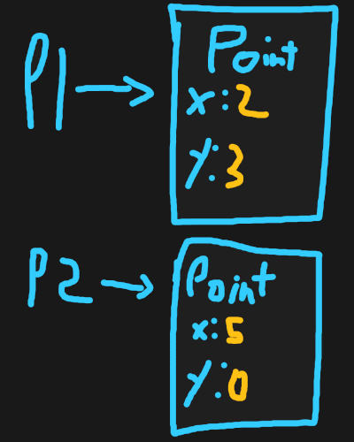

# No Class No Problem, And Other Lies

## Problems Problems Problems

**I highly recommend you as the reader to write the code shown here. Don't copy and paste, write everything word for word. You're encouraged to experiment.**

The idea behind classes should be intuitive, as they simply allow us to group related data together. However, to prove their usefulness through example, let me introduce to you a program. The program is simple. It adds points.

```java
public class Main
{
	public static void main(String[] args)
	{
		// (2, 3)
		double x1 = 2;
		double y1 = 3;

		// (5, 0)
		double x2 = 5;
		double y2 = 0;

		// p1 + p2
		double x3 = x1 + x2;
		double y3 = y1 + y2;

		String output = String.format("(%.2f, %.2f) + (%.2f, %.2f) = (%.2f, %.2f)", x1, y1, x2, y2, x3, y3);
		System.out.println(output);
	}
}
```

Running this, we get the result:

```
(2.00, 3.00) + (5.00, 0.00) = (7.00, 3.00)
```

The code works fine, however, the issues that exist are not regarding the functionality of the code. Rather, it regards the scalability of the code. If we want to display another result where we subtract two points, here’s how’d we go about that:

```java
public static void main(String[] args)
{
	// (2, 3)
	double x1 = 2;
	double y1 = 3;

	// (5, 0)
	double x2 = 5;
	double y2 = 0;

	// p1 + p2
	double x3 = x1 + x2;
	double y3 = y1 + y2;

	double x4 = 20;
	double y4 = 30;

	double x5 = 24;
	double y5 = 30;

	double x6 = x5 - x4;
	double y6 = y5 - y4;

	String output = String.format("(%.2f, %.2f) + (%.2f, %.2f) = (%.2f, %.2f)", x1, y1, x2, y2, x3, y3);
	String output2 = String.format("(%.2f, %.2f) - (%.2f, %.2f) = (%.2f, %.2f)", x5, y5, x4, y4, x6, y6);
	System.out.println(output);
	System.out.println(output2);
}
```
And indeed, we get the output:
```
(2.00, 3.00) + (5.00, 0.00) = (7.00, 3.00)
(24.00, 30.00) - (20.00, 30.00) = (4.00, 0.00
```

You’ll notice that messing up this code can be really easy. Seeing how we have points ranging from 1 to 6, it’s incredibly easy to press the wrong button and add x5 to x3. And since we’re adding multiple times, it’d also be easy to mess up and add x and y together rather than just the x. Also note that if we choose to represent the points as vectors, more complicated operations, such as scalar multiplications, normalization, and getting the magnitude would be difficult to interpret just based on the code, and it would also require the memorization of the formulas while ensuring that we write down the formulas correctly every time.

Other problems include outputting the string representation of a point. Outputting just three points takes up almost the entire width of my screen, and if I were to update how I choose to represent each point, I’d have to update two different locations. It may not look like much with a codebase of fewer than 100 lines, but it’s common to have codebases that are more than a thousand lines of code, and updating every instance where a point could be printed would be a hassle of a task.

Along with that, we have one more problem. Suppose we want to make it clear that we’re adding points by writing a method such as this:

```java
public static int add_points(int x1, int x2, int y1, int y2)
```

Well, here’s the problem. It’s impossible to return more than one value. Since a point stores two values, it not only makes it inconvenient to write a method such as this but also close to impossible. So, how do we solve this crisis?

## Making a Point class

Making a point class is rather straight forward. Here's the simplest version:
```java
// Note: This would be outside of the main class but within the same file. Later on, we'll discuss Java projects with multiple files.
class Point
{
	double x;
	double y;
}
```

There you have it. Our new code would look like this:

```java
public static void main(String[] args)
{
	// (2, 3)
	Point p1 = new Point();
	p1.x = 2;
	p1.y = 3;

	// (5, 0)
	Point p2 = new Point();
	p2.x = 5;
	p2.y = 0;

	// p1 + p2
	Point p3 = add_points(p1, p2);

	// For brevity, the subtraction part was removed

	String output = String.format("(%.2f, %.2f) + (%.2f, %.2f) = (%.2f, %.2f)", p1.x, p1.y, p2.x, p2.y, p3.x, p3.y);
	System.out.println(output);
}

public static Point add_points(Point p1, Point p2)
{
	Point p = new Point();
	p.x = p1.x + p2.x;
	p.y = p1.y + p2.y;
	return p;
}
```

This shouldn't be difficult to understand. All we have done is group related data together under a common name. We do this by creating `Point` objects, which are objects that follow the same structure described in the `Point` class. Do not let the terminology frighten you. An Object is simply what we call any instance of class, while a class simply describes the structure of the object.



This can be better visualized as such. Notice how every `Point` object has the fields `x` and `y`. This is because we defined the structure of a `Point` object when we defined `class Point`. We can then modify each field by using the `.` (dot) operator. Sp, `p2.x = 5` changes the `x` variable in the `p2` object to 5, instead of the default 0.

To create a new `Point` object for us to modify, we use the `new` operator, followed by the type and parenthesis, as if we are invoking a method. The reasoning for this will be covered later. For now, take `new Point()` as how you create a new `Point` object.

## Making Code Easier
Notice that we have three problems. `add_points` for one, is in an inappropriate place. You can imagine when you're dealing with 100s of data, and each group of data has its own group of methods related, throwing all the methods in a single file can become counter-productive. The second problem is that constructing point objects is also tedious, as we need to assign every value manually. For classes that are more sophisticated, this can become troublesome quickly. The other problem is that outputting each point is not only time-consuming, but if we want to change how we print point, we have to look through every needle in the haystack, and in a large program, that can destroy the momentum of the project.

### The First Problem, Methods

We have several ways of fixing the first problem, all of which are rather simple. We can first start by adding a static method to point as such:
```java
class Point
{
	double x;
	double y;

	public static Point add_points(Point p1, Point p2)
	{
		Point p = new Point();
		p.x = p1.x + p2.x;
		p.y = p1.y + p2.y;
		return p;
	}
}
```

All we did is displace the method from the `Main`class to the `Point` class. This means, to invoke the method, we do the following:

```java
Point p3 = Point.add_points(p1, p2);
```

Very straightforward. We could do even better, however. Since the method is focused on the `Point` class, we can make it an instance method. It'll be better to demonstrate it now and explain later, so here's the code:

```java
class Point
{
	double x;
	double y;

	// We removed static and replaced the p1 parameter with "this"
	public Point add(Point other)
	{
		Point p = new Point();
		p.x = this.x + other.x;
		p.y = this.y + other.y;
		return p;
	}
}
```

And to use the method:
```java
Point p3 = p1.add(p2);
```

All we effectivelly did is bring the focus on p1. `this` refers to the main object, which is the one that precedes the `.` (dot), in this case, `p1`. Using the same pattern, we can add more methods and quickly make complex operations:

```java
class Point
{
	double x;
	double y;

	public Point add(Point other)
	{
		Point p = new Point();
		p.x = this.x + other.x;
		p.y = this.y + other.y;
		return p;
	}

	public Point negate()
	{
		Point p = new Point();
		p.x = -1 * this.x;
		p.y = -1 * this.y;
		return p;
	}

	public Point subtract(Point other)
	{
		// Notice how we're combining the methods made before to make the code simple and easy to understand
		return p.add(other.negate());
	}
}
```

And again, to use these methods:
```java
// We are able to call negate() after .add(p2) because .add(p2) returns a new point, so "this" refers to the point returned by add.
Point p3 = p1.add(p2).negate();
```

### The Second Problem, Constructors

Just as before, this is a very simple problem to solve. Here's the code:

```java
class Point
{
	double x;
	double y;

	// The default constructor. If we define our own constructor without defining one that takes 0 parameters, then "new Point()" would result in an error as the constructor won't exist. The default constructor is assumed if we don't define our own, hence the name.
	// Since the constructor only declares the variables x and y, it will use the default value for doubles, which is 0, unless we change them.
	public Point()
	{
	}

	// Our own constructor, which takes an x and y and immediately assigns them to the instance x and y. Since the instance x and y and the parameters have the same name, we refer to the instance as "this" and the parameters regularly.
	public Point(double x, double y)
	{
		this.x = x;
		this.y = y;
	}

	// Blah blah blah...
}
```

Notice that constructors don't have a return type, and they have the same naem as the class. The two facts are necessary to have to define a constructor. If the name doesn't match, there will be an error, and if it has a return type, it'll be a method and not a constructor.

To use the constructors:

```java
// To use the default constructor (same as before)
Point p1 = new Point();
p1.x = 2;
p1.y = 3;

// To use the newly defined constructor
Point p2 = new Point(5, 0);
```

Both do the same thing, but the latter is much easier to read and would be the standard way of constructing a new class.

### The Third Problem, toString
We're close to wrapping this up! But I thought I'd show you one more benefit by teasing what our next meeting will be out, inheritance. I won't get into it here too much, instead I'll just show you the code and you can figure out how it works on your own.

```java
class Point
{
	// Blah blah blah...

	@Override
	public String toString()
	{
		return String.format("(%.2f, %.2f)", this.x, this.y);
	}
}
```

And to use the method:

```java
String output = p1 + " + " + p2 + " = " + p3;
System.out.println(output);
```
Isn't that so much better?

## Conclusion
There is **A LOT** I have not brought up in this article. The truth is, is that there is a ton of information to learn regarding classes, and you'll likely still be learning about them for the next year. Things such as aliasing, inheritance (will be covered next), mutability, access modifiers, generics, and most importantly, the skill to design your classes so that they're intuitive and easy to learn.

The reason why I'm not including these is because I'm not making a full Java course, that would take months of work. I simply aim to get you started, because it's when you develop your projects, no matter how amateur they are, is when you really learn and embed this information. It's also when you'll remember what aliasing is because you've made the same error 30 times, or when you should put things into classes because you realize that what you're looking at is a bunch of spaghetti code. It's also when you start designing decently sized applications that you begin to learn many of the principles that drive OOP, and what OOP even is.

With that, I hope you've had fun with the lesson, and as always, if you have questions, you can reach me at amrojjeh@outlook.com.
